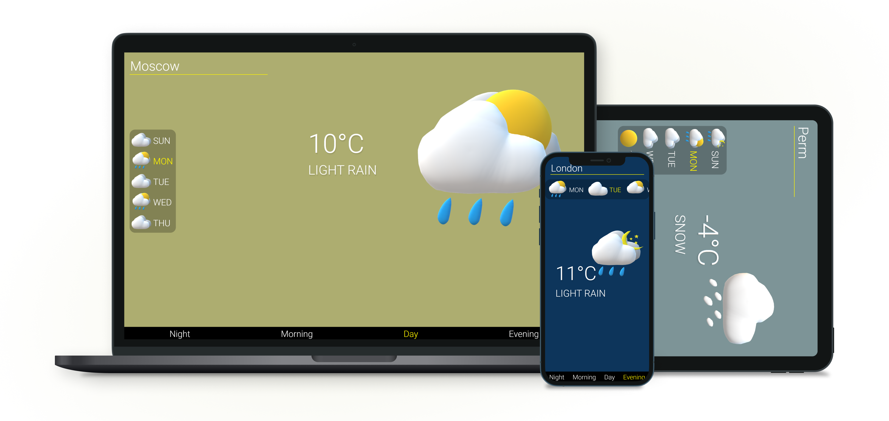

# Weather forecast

## Weather forecast single page application

During my 2021 summer practice i was should to build an application with using an Public API, so i've choosed to use Weather API'S.

## Table of contents

- [Overview](#overview)
  - [Tasks](#tasks)
  - [Adaptive](#adaptive)
  - [How it works](#how-it-works)
  - [Live site](#live-site)
- [My process](#my-process)
  - [Built with](#built-with)
  - [What I've learned](#what-i've-learned)
  - [Continued development](#continued-development)
  - [Useful resources](#useful-resources)
  - [Set up](#set-up)
- [Contacts](#contacts)

## Overview

### Tasks

Create a application that solves the problem of weather forecasting:

- [x] The choice of almost any major city on the planet
- [x] Getting forecast data for several days at once
- [x] Getting data on weather changes during the day
- [x] Visual images and effects of their changes

### Adaptive

### How it works

https://user-images.githubusercontent.com/79471942/150642619-9a3ea951-9ca7-42a6-b3db-7f91f0be52e3.mp4

### Live site

[Github pages](https://voladdd.github.io/weather-forecast/)

## My process

### Set up

#### Start live static server

`npx serve`

### Built with

- HTML & CSS
- Vanilla JS
- API OPEN WEATHER
- 3D Paint

### What I've learned

- How to fetch api requests
- Working with JSON files
- Adding event listeners
- Working with svg files
- How to create simple 3D assets
- Basic animation with javascript

### Continued development

In future i would like to learn modern js component library such as react, in hope that it would make project more scalable and easy to maintain, instead of vanilla js.

### Useful resources

- [API OPEN WEATHER](https://openweathermap.org/api)

## Contacts

- Github - [@voladdd](https://github.com/voladdd)
- Linkedin - [link](https://www.linkedin.com/in/vlad-selivanov-190725212/)
- Email - artosan360@gmail.com
